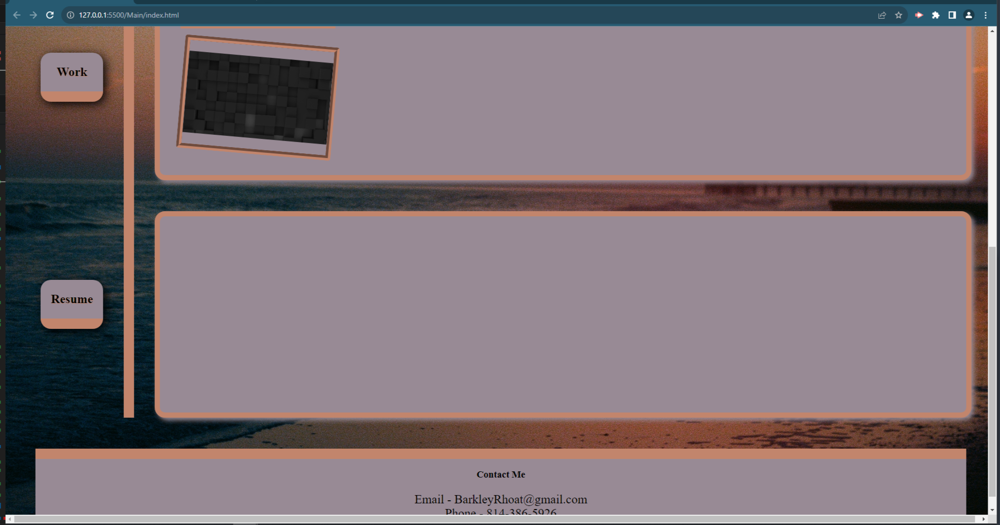

# advanced-css-portfolio

## Description

This project is the start of my portfolio that i am creating throughout this course. I will be using this portfolio to show potential employers. 

## Table of Content 

- [Instalalation](#installation)
- [usage](#usage)
- [Credits](#credits)
- [Liccense](#license) -- https://opensource.org/license/MIT

## Installation 

https://barkleyrhoat.github.io/advanced-css-portfolio/

## Usage

to access this website you will click the link in github or type in the url address ""

## Credits

Referenced: MDN Web Docs - Link (https://developer.mozilla.org/en-US/docs/Web/CSS , https://developer.mozilla.org/en-US/docs/Web/HTML)

## License
